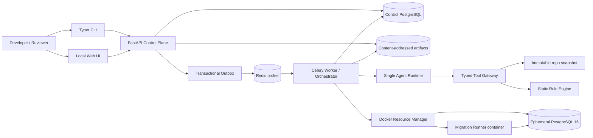

# ShadowOps MVP 架构设计 v0.1

> 状态：已确认（2026-08-25）｜依据：[PRD](../PRD.md) v0.1｜阶段边界：本文只定义架构，不初始化应用脚手架或实现业务代码

## 1. 架构结论

ShadowOps 采用 **模块化单体控制面 + 独立异步 Worker + 每次审计一组隔离容器**。API、CLI 和本地 Web 共用同一应用服务；PostgreSQL 控制库保存权威状态，Redis 只承担至少一次消息投递；Worker 通过数据库状态机推进步骤。一个受限 Agent 负责证据检索、计划生成和报告解释，确定性编排器负责执行顺序、风险下限、重试、审批和资源回收。

首版技术基线：Python 3.12、FastAPI、Pydantic、SQLAlchemy/Alembic、Typer、Jinja2 + 少量原生 JavaScript、Celery + Redis、Docker Engine、PostgreSQL 16。依赖以 `uv` 和 lockfile 固定；PostgreSQL 与 Runner 镜像在实现时固定到 digest。首版不引入 LangChain、多 Agent、React、Kubernetes 或独立微服务。

### 架构质量目标

优先级依次为：**安全边界 > 证据可追溯 > 任务可恢复 > 结果可复现 > 开发速度 > 横向扩展**。这是本地单用户开发工具，不追求多租户吞吐；但状态、幂等、隔离与评测接口按可演示的工程标准实现。

## 2. 系统组成



### 组件职责

| 组件 | 唯一职责 | 不负责 |
|---|---|---|
| CLI | 创建任务、查看状态、打开报告 | 直接运行 Migration |
| Web/API | 参数校验、查询、报告与审批接口、SSE 进度 | 长任务、LLM 自主循环 |
| Application Service | 用例编排入口、权限/审批前置校验 | Docker 细节 |
| Outbox Dispatcher | 将数据库事件可靠投递到 Redis | 保存任务真相 |
| Worker/Orchestrator | 领取步骤、推进状态机、超时/重试/finalizer | 自由改变风险策略 |
| Agent Runtime | 受限工具调用、结构化计划、证据化解释 | 直接操作 Docker、Shell、审批状态 |
| Rule Engine | AST/SQL 规则与确定性严重度 | 用语言模型代替规则命中 |
| Docker Resource Manager | 容器、网络、卷、租约与清理 | 执行 Agent 生成的任意命令 |
| Runner | 在隔离容器中执行 Alembic/受控检查 | 获取控制库或 LLM 密钥 |
| Policy Engine | 风险聚合和审批门禁 | 被 Agent 降级或绕过 |

## 3. 端到端时序

1. `POST /api/v1/runs` 接收仓库路径与 diff 目标；API 校验路径位于允许根目录内。
2. Snapshot Service 解析 Git 选择器，将本次审计需要的仓库内容复制为不可变、内容寻址快照，记录 commit、dirty diff hash 和 snapshot hash；后续步骤不再读取变化中的工作区。
3. API 在同一数据库事务内写入 `audit_run(QUEUED)` 和 outbox 事件，立即返回 `run_id`。
4. Dispatcher 发布消息；Worker 以 `run_id + expected_state + step_key` 领取任务。重复消息只会返回已有步骤结果。
5. Discovery 只用 AST/配置解析识别 `alembic.ini`、`script_location`、revision、`down_revision` 与目标链；不在宿主进程 import 仓库代码。无法静态求值的情况交给隔离 Runner 验证。
6. Rule Engine 对 Python AST、Alembic `op.*` 调用和原始 SQL 进行确定性检查，保存带文件位置的 findings。
7. Agent 只可调用只读发现工具，输出 `AuditPlanV1`；Plan Validator 检查 JSON Schema、允许步骤、依赖、预算和必需安全步骤。无效计划可修复一次，仍无效则失败并保留证据。
8. Resource Manager 创建每次运行独立的 internal Docker network、Runner 和 Shadow PostgreSQL。Runner 将仓库快照只读挂载，先升级到目标 Migration 的父 revision，再执行目标链。
9. 加载显式 fixture；没有 fixture 时，由固定 seed 和 schema 元数据生成有限合成数据。生成器不支持的类型/约束记录为 coverage gap，而不是假定已覆盖。
10. Runner 执行 upgrade、schema/data smoke checks、downgrade/upgrade roundtrip，输出结构化结果；原始 stdout/stderr 作为 artifact 保存并做密钥脱敏。
11. finalizer 释放容器、网络和卷；报告/审批阶段不持有 Docker 资源。
12. Agent 仅从持久化 evidence 生成 `RiskReportV1`；Policy Engine 计算最终风险。高风险、关键未知、upgrade 失败或 rollback 失败进入 `AWAITING_APPROVAL`，否则 `COMPLETED`。
13. 审批请求必须携带 `report_hash`。报告内容变化后，旧审批自动失效；批准或拒绝都只记录团队决策，不触发合并、部署或生产变更。

## 4. 状态机与可靠异步任务

主状态与 PRD 保持一致：

`QUEUED → DISCOVERING → STATIC_ANALYSIS → PLANNING → PROVISIONING → BASELINE_READY → APPLYING → SEEDING → SMOKE_TESTING → ROLLBACK_VERIFYING → REPORTING → COMPLETED | AWAITING_APPROVAL → APPROVED | REJECTED`

任一非终态可按策略进入 `FAILED` 或 `CANCELLED`。资源清理由正交字段 `cleanup_status = NOT_REQUIRED | PENDING | RUNNING | SUCCEEDED | FAILED` 表示，避免把业务状态和资源状态混在一个枚举中。只有 `cleanup_status ∈ {NOT_REQUIRED, SUCCEEDED}` 时，动态执行任务才可正常终结；清理失败由 Sweeper 按容器标签和租约继续回收并发出告警。

### 投递、领取与幂等

- **数据库是真相源**：Celery result backend 不作为任务状态依据，Redis 丢失不导致业务状态丢失。
- **Transactional Outbox**：创建/推进 run 与待投递事件同事务提交；Dispatcher 重试未发布事件。
- **至少一次投递**：Worker 使用状态条件更新或行锁领取；`step_key = run_id:stage:generation` 唯一约束阻止重复执行。
- **乐观并发**：`audit_runs.version` 每次状态迁移递增；过期 Worker 不能覆盖新状态。
- **心跳与租约**：运行步骤和影子环境均有 `lease_expires_at`；Reconciler 处理 Worker 崩溃和孤儿容器。
- **重试分类**：纯读取/报告步骤原地有限重试；网络/LLM 错误退避；Migration apply 不在同一数据库上重放，而是递增 `environment_generation` 并从 `PROVISIONING` 重建。
- **取消**：先写入 `cancel_requested_at`；Worker 在安全检查点停止，finalizer 清理。运行中的数据库语句由 statement timeout 和容器终止兜底。
- **恢复**：服务重启后 Reconciler 扫描非终态 run、过期 lease 和未发布 outbox，决定重新投递、重建环境或标记失败。

## 5. 单 Agent 与 Tool Calling

### 两次受限推理、一个 Agent 身份

同一 Agent 配置在一个 run 内承担两个阶段：

1. **Planner**：读取 revision/规则证据，选择允许的检查步骤并输出计划。
2. **Reporter**：读取执行证据，解释风险、缺口和修复建议并输出报告。

两阶段之间不保持隐式聊天记忆；上下文来自版本化数据库记录。这样便于复现、评测和失败恢复。模型、system prompt、tool schema、温度/推理参数及输入 evidence hash 均写入 `agent_invocations`。

### 权限分层

| 工具类别 | Agent 可主动调用 | 执行者 | 示例 |
|---|---:|---|---|
| 只读发现 | 是 | 控制面 Tool Gateway | `discover_migrations`、`read_revision`、`get_static_findings` |
| 计划能力描述 | 是 | 控制面 | `describe_shadow_capabilities`、`get_test_data_profile` |
| 有副作用执行 | 否，只能写入计划 | Orchestrator | `provision_shadow_db`、`apply_target_migrations`、`load_test_data` |
| 证据读取 | Reporter 可调用 | 控制面 | `get_step_result`、`get_evidence`、`inspect_schema_diff` |
| 审批/策略 | 否 | Policy Engine/API | `request_human_approval`、`approve`、`reject` |

PRD 中的工具名是产品能力清单；架构上故意不把 Docker 和审批工具直接暴露给模型。Agent 能“选择”执行能力，但只有通过 schema 校验的计划才能由编排器调用固定实现。

### `AuditPlanV1` 最小契约

```json
{
  "schema_version": "1.0",
  "objective": "audit revisions <base>..<target>",
  "steps": [
    {
      "id": "apply_target",
      "capability": "apply_target_migrations",
      "depends_on": ["upgrade_baseline"],
      "timeout_seconds": 120,
      "required": true,
      "reason": "Validate upgrade against seeded shadow schema",
      "evidence_refs": ["revision:abc123", "finding:RISK-004"]
    }
  ],
  "coverage_gaps": [],
  "assumptions": []
}
```

Validator 额外强制插入或拒绝缺失的安全步骤：baseline、target apply、smoke、rollback roundtrip、evidence collection 和 cleanup。模型不能提高预算、提供命令字符串、指定镜像、网络或宿主路径。

## 6. 控制面数据模型

| 表 | 核心字段/约束 |
|---|---|
| `audit_runs` | `id`, repo/diff refs, snapshot hash, state, risk level, version, heartbeat, timestamps |
| `run_steps` | run, stage, generation, attempt, status, input/output hashes, error code；`(run, step_key)` 唯一 |
| `repo_snapshots` | source path hash, commit, dirty diff hash, artifact URI, content hash |
| `static_findings` | rule id/version, severity, confidence, location, message, evidence refs |
| `agent_invocations` | phase, provider/model, prompt/tool schema versions, input/output hashes, token/latency/error metadata |
| `tool_calls` | invocation, tool/version, arguments hash, result hash, duration, status, correlation id |
| `shadow_environments` | run, generation, container/network ids, image digests, lease, cleanup status |
| `evidence_items` | kind, producer, artifact URI/inline JSON, sha256, redaction status, created_at |
| `risk_reports` | version, report JSON, rendered HTML URI, max severity, content hash, supersedes id |
| `approvals` | report id/hash, decision, actor, comment, decided_at；每个报告最多一个有效决策 |
| `outbox_events` | aggregate/version, topic, payload, published_at, attempts |

大日志、schema dumps 和报告 HTML 存在本地 content-addressed artifact store；数据库只保存摘要、URI 与 SHA-256。写 artifact 使用临时文件 + 原子 rename，数据库引用只指向完成写入的对象。首版默认本地保留，可按 run 删除；删除控制库记录与 artifact 采用可审计的两阶段清理。

## 7. Repository 与 Alembic 解析边界

- Git 解析支持：默认 `HEAD` 对工作区/暂存区、显式 `base..head`；记录实际 resolved commit SHA。
- 快照复制拒绝逃逸允许根目录的路径、越界 symlink、设备文件和超限文件；`.git`、虚拟环境、缓存和 secrets pattern 默认排除。
- revision 元数据优先由 Python AST 读取，绝不在宿主 import `env.py` 或 revision 文件。
- MVP 只支持单个 Alembic script location、线性目标链；多 head、branch merge、动态 `down_revision` 作为高风险/不支持证据报告，不静默猜测。
- 用户仓库的 Alembic 执行只发生在 Runner。基线是目标链第一个 revision 的父 revision；如果无法构造基线，动态审计失败，但静态报告仍可生成。
- 修改既有已发布 revision 与新增 revision 分开标记；前者默认高风险，因为可能造成环境漂移。
- MVP Runner 内置 Python、Alembic、SQLAlchemy 与 PostgreSQL driver；只保证迁移依赖这些组件或仓库内模块的兼容 profile。缺少第三方依赖时记录为 `UNSUPPORTED_DEPENDENCY`，不在审计过程中联网安装任意包。支持 lockfile 构建自定义 Runner 属于后续能力。

## 8. Docker 影子环境与威胁模型

每个 `run + generation` 创建独立 Runner 与 PostgreSQL 容器。Runner 镜像只包含受支持的 Python/Alembic 驱动和 ShadowOps runner entrypoint；仓库快照只读挂载到固定路径，写入仅允许 tmpfs 工作目录。PostgreSQL 数据使用命名临时卷。

强制约束：

- Runner 非 root、`cap_drop=ALL`、`no-new-privileges`、默认 seccomp、只读 root filesystem、PID/CPU/内存/磁盘/时长限制。
- 使用 Docker internal network；不发布数据库端口、不访问公网。Runner 只获得临时 Shadow DB 凭据。
- 不把 Docker socket、宿主凭据、控制库 DSN、LLM key 或用户 home 挂入 Runner。
- 所有资源带 `shadowops.run_id`、generation、lease 标签；正常 finalizer 与周期 Sweeper 双重清理。
- 镜像 allowlist 和 digest 由服务配置决定，Agent/仓库不能覆盖。
- Migration 任意 Python 代码仍被视作不可信。Docker 隔离降低而非消除容器逃逸风险；MVP 定位是可信开发机上的本地审计工具，不作为敌对多租户沙箱。

## 9. 静态/动态风险与审批策略

最终严重度由确定性 Policy Engine 聚合：`max(static severity, dynamic severity, mandatory policy overrides)`。Agent 可增加解释或建议，但不能降低规则/执行给出的严重度。

强制进入高风险门禁的条件：命中高风险规则；upgrade/rollback 失败；目标 revision 不一致；关键证据缺失；Runner 超时/越权；计划覆盖缺口涉及破坏性操作。表大小、锁等待和真实生产数据分布未知时，报告显式区分 `observed_in_shadow`、`inferred`、`unknown_in_production`。

报告至少包含：输入范围与 hash、revision 链、静态 findings、执行计划、每步结果、schema/data 差异、rollback 结果、未覆盖项、证据链接、最终风险、建议与审批状态。每个事实型结论必须引用 `evidence_id`；无引用的模型文字只能出现在“建议/推断”区。

审批接口使用 optimistic version + `report_hash` 防止 TOCTOU；API 在事务内再次检查 run 状态和报告有效性。UI 默认绑定 `127.0.0.1`，使用启动时生成的本地 session secret、CSRF token 和显式 actor 名称；首版不做 OAuth。

## 10. API、CLI 与本地 UI

建议的首批 API：

- `POST /api/v1/runs`：创建审计，支持 idempotency key。
- `GET /api/v1/runs/{run_id}`：状态、步骤与风险摘要。
- `GET /api/v1/runs/{run_id}/events`：SSE 进度流。
- `POST /api/v1/runs/{run_id}/cancel`：请求取消。
- `GET /api/v1/reports/{report_id}`：结构化报告。
- `POST /api/v1/reports/{report_id}/decision`：基于 report hash 批准/拒绝。
- `GET /health/live`、`GET /health/ready`、`GET /metrics`。

CLI 提供 `shadowops audit PATH [--base REF --head REF]`、`shadowops status RUN_ID`、`shadowops open RUN_ID` 和 `shadowops cancel RUN_ID`。CLI 默认调用本地 API，不复制编排逻辑。Web 使用服务端模板呈现任务时间线、findings、证据和审批表单；首版不引入 Node 构建链。

## 11. 可观测性、隐私与评测挂点

- 所有请求、run、step、agent invocation、tool call 和容器日志共享 `correlation_id/run_id`；日志为结构化 JSON。
- 数据库步骤时间线是用户可见的审计轨迹；日志不是唯一证据源。
- 指标覆盖 queue lag、各阶段时延/结果、retry、stale lease、orphan cleanup、规则命中、Agent schema-valid、审批门禁和 artifact 大小。
- 关键边界建立 trace span：HTTP、outbox publish、worker stage、Agent、tool、Docker、SQL；首版支持 OTLP 导出但不强制部署可视化栈。
- Prompt 输入在进入外部模型前按规则去除 DSN、token、`.env` 和疑似密钥；原始仓库默认不整库发送，只发送相关 revision 片段与最小上下文。
- `EvaluationRecorder` 可将同一输入替换为 fixture snapshot、Fake Agent 或录制响应，使规则、编排、故障恢复和 Agent 评测可独立运行。

## 12. 进程与部署拓扑

本地 `docker compose` 运行四个长期服务：`api`、`worker`、`control-postgres`、`redis`。`dispatcher/reconciler/sweeper` 首版作为 Worker 内不同队列/定时任务运行，不拆独立服务。每次审计动态创建短期 Runner + Shadow PostgreSQL，结束后销毁。

API 只读挂载显式配置的 `SHADOWOPS_REPO_ROOT`，用户提交的是该根目录内的相对路径；Snapshot Service 是唯一读取此挂载的模块。Worker 作为受信任的基础设施组件访问宿主 Docker socket 以创建短期容器，因此本地 Worker 等价于拥有 Docker daemon 权限；Agent、Runner、用户 Migration 和 Web 请求均不能直接触达 socket。远程/多租户部署必须改用独立 sandbox service，不能照搬此信任模型。

开发时 API 也可在宿主通过 `uv run` 启动，但正式 Demo 以 Compose 为准。Docker 守护进程是本地基础设施依赖，运行集成/E2E 前必须可用；项目通过 `uv` 安装并锁定 Python 3.12，不依赖宿主系统 Python 版本。

## 13. 关键架构决策与延后项

| 决策 | 选择 | 原因/代价 |
|---|---|---|
| 应用形态 | 模块化单体 + Worker | 边界清晰且适合一人完成；未来可拆分，但首版不展示微服务数量 |
| 任务真相源 | Control PostgreSQL | 支持事务、状态锁和审计；比依赖 broker result 更可靠 |
| 消息投递 | Celery + Redis + outbox | 展示成熟异步模式；多一个基础设施组件，但职责单一 |
| Agent | 原生 provider adapter + JSON Schema/tool calling | 可评测、少框架魔法；需要自行实现小型 runtime |
| 风险决策 | 规则/Policy Engine 确定性下限 | 防止模型降低风险；模型负责上下文解释而非最终授权 |
| UI | Jinja2 + 原生 JS/SSE | 足以展示报告与审批，避免前端工程吞噬 MVP 时间 |
| 执行环境 | Runner + Shadow DB 双容器 | 不在 Worker import/执行仓库代码；资源管理更复杂但安全边界明确 |
| PostgreSQL | 首版固定 16 | 保持评测可复现；不声称覆盖其他主版本 |

延后到 MVP 之后：多 PostgreSQL 版本矩阵、复杂 Alembic branch/merge、多 script location、生产规模数据建模、远程 Git、团队身份系统、分布式 artifact store、Kubernetes 和自动 PR 集成。

## 14. 架构阶段验收

以下结论已于 2026-08-25 确认：

1. 接受 FastAPI + Celery/Redis + Control PostgreSQL 的本地四服务组合。
2. 接受 PostgreSQL 16 作为唯一声明支持的 MVP 版本。
3. 接受 Agent 不能直接调用副作用/审批工具，而是提交受校验计划。
4. 接受复杂 Alembic 多 head/merge 在 MVP 中报告为高风险或不支持。
5. 接受服务端模板 UI，首版不建立 React 前端。

第三阶段产物见[开发计划](./DEVELOPMENT_PLAN.md)；开发计划确认后再初始化脚手架。
